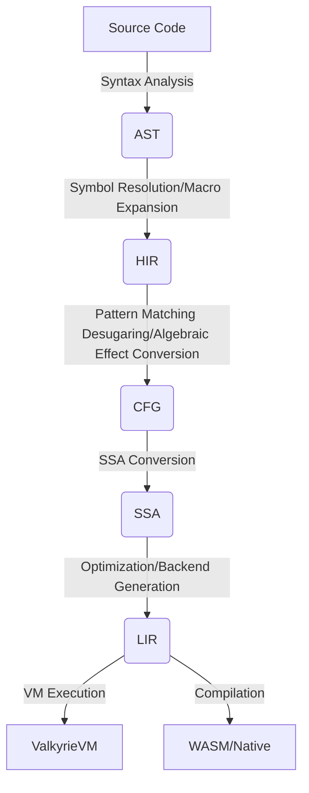

# Valkyrie Compiler Optimization Strategies: An Ultimate Journey from Abstract Syntax to Machine Code

## Foreword

This document comprehensively expounds on the multi-layer Intermediate Representation (IR) architecture adopted by the Valkyrie compiler and deeply analyzes the core optimization strategies implemented at each IR layer. Valkyrie's design philosophy is rooted in: **Layered Abstraction** and **Progressive Desugaring**.

## Chapter 1: Architectural Philosophy and Optimization Overview

### 1.1 Core Design Philosophy

1.  **Layered Abstraction**
    Valkyrie decomposes the compilation process into 5 specialized IR layers:
    *   **AST (Abstract Syntax Tree):** Directly reflects the source code structure.
    *   **HIR (High-level IR):** Carries full semantics, performing pattern matching desugaring and symbol resolution.
    *   **CFG (Control Flow Graph):** Eliminates high-level control flow structures (e.g., loops, branches) and converts them into basic blocks.
    *   **SSA (Static Single Assignment):** Implements classic data flow optimizations (e.g., constant propagation, dead code elimination).
    *   **LIR (Low-level IR):** Approaches target hardware (e.g., WASM or VM bytecode).

### 1.2 Multi-layer IR Architecture Overview

*   **AST:** Syntax normalization.
*   **HIR:** Core of semantic analysis.
*   **CFG:** Foundation for control flow analysis.
*   **SSA:** Core optimization engine.
*   **LIR:** Target generation.

## Chapter 2: Detailed Phase Optimization

### 2.1 AST Phase
*   **Macro Expansion:** Handles code generation at the syntax level.
*   **Constant Folding:** Basic arithmetic pre-calculation.

### 2.2 HIR Phase
*   **Symbol Resolution:** Determines the domain of variables and functions.
*   **Pattern Matching Desugaring:** Converts complex `match` structures into decision trees.
*   **Algebraic Effect Conversion:** Transforms `try/handle` logic into stack operations.

### 2.3 CFG Phase
*   **Unreachable Code Elimination:** Removes basic blocks that cannot be executed.
*   **Block Merging:** Merges basic blocks with a single exit/entry to reduce jumps.

### 2.4 SSA Phase
*   **Sparse Conditional Constant Propagation (SCCP):** Constant propagation combined with control flow.
*   **Common Subexpression Elimination (CSE):** Removes redundant calculations.
*   **Dead Code Elimination (DCE):** Removes assignments that have no side effects and are unused.

### 2.5 LIR Phase
*   **Register Allocation/Stack Slot Allocation:** Memory layout optimization for the target machine.
*   **Peephole Optimization:** Local instruction replacement.

---
*Note: Valkyrie is committed to extracting every bit of performance through deep SSA optimization while ensuring type safety.*
