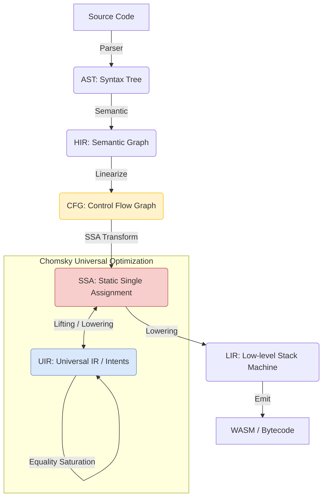

# Nyar VM Project Architecture and Maintenance Guide

**Document Version**: 1.0
**Target Audience**: Core developers and maintainers of the Nyar project

## 1. Top-level Design Principles

Nyar's architecture follows best practices in modern compiler design, aiming to balance high performance, extensibility, and development efficiency.

### 1.1 Progressive Lowering

Nyar decomposes the complex compilation process into 5 main Intermediate Representation (IR) phases. Each phase has a single responsibility and is transformed through a series of passes.

- **AST -> HIR**: Introduces scopes, name resolution, and type information.
- **HIR -> CFG**: Converts structured code (e.g., `if`, `while`) into basic blocks and explicit jumps.
- **CFG -> SSA**: Versions variables, inserts Phi nodes, and facilitates data flow analysis.
- **Chomsky Universal Optimization**:
    - **Lifting**: Lifts SSA or higher-level IR into **UIR (Universal IR)**.
    - **Equality Saturation**: Uses the E-Graph engine to search for the optimal path in the equivalence space.
    - **Cost Model Extraction**: Extracts the best implementation based on the cost model of the target backend (e.g., `nyar-vm`).
- **SSA -> LIR**: SSA destruction, phi elimination, and lowering to stack-based instructions.
- **LIR -> Emit**: Final generation of executable bytecode.

### 1.2 Developer Experience (DX) First

- **Diagnostic Information**: Provides high-quality error reporting.
- **Instant Feedback**: Achieves rapid iteration through efficient incremental compilation.

## 2. Project Organization (Crate Structure)

Nyar adopts a Rust Monorepo structure, with all core components located in the `projects/` directory.

- **`nyar-types`**: **Core IR Definition Library**. Contains data structures for HIR, CFG, SSA, and LIR.
- **`nyar-vm`**: **Interpreter and Runtime**. Implements the stack-based bytecode interpreter.
- **`nyar-aot`**: **Compiler and Optimizer**. Responsible for transformations between phases, optimization using Chomsky, and final bytecode generation.
- **`nyar-tools`**: Command-line tools.

## 3. Maintenance Process

### 3.1 Adding New Optimization Passes
1. Implement the corresponding optimization logic in the `nyar-aot` directory, typically leveraging the Chomsky framework.
2. Write unit tests and snapshot tests to verify the output.
