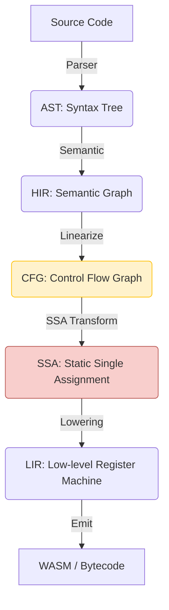

# Valkyrie Project Architecture and Maintenance Guide

**Document Version**: 1.0
**Target Audience**: Core developers and maintainers of the Valkyrie project

## 1. Top-level Design Principles

Valkyrie's architecture follows best practices in modern compiler design, aiming to balance high performance, extensibility, and development efficiency.

### 1.1 Progressive Lowering

Valkyrie decomposes the complex compilation process into 5 main Intermediate Representation (IR) phases. Each phase has a single responsibility and is transformed through a series of passes.

- **AST -> HIR**: Introduces scopes, name resolution, and type information.
- **HIR -> CFG**: Converts structured code (e.g., `if`, `while`) into basic blocks and explicit jumps.
- **CFG -> SSA**: Versions variables, inserts Phi nodes, and facilitates data flow analysis.
- **SSA -> LIR**: SSA destruction, register allocation, oriented towards physical/virtual machine instructions.

### 1.2 Developer Experience (DX) First

- **Diagnostic Information**: Uses `miette` to provide high-quality error reporting.
- **Instant Feedback**: Achieves rapid iteration through efficient incremental compilation (planned).

## 2. Project Organization (Crate Structure)

Valkyrie adopts a Rust Monorepo structure, with all core components located in the `projects/` directory.

- **`valkyrie-types`**: **Core IR Definition Library**. Contains data structures for HIR, CFG, SSA, and LIR.
- **`valkyrie-vm`**: **Core Logic and Pass Implementation**. Responsible for transformations between phases, optimization, and final execution.
- **`valkyrie-error`**: Unified error definitions and diagnostic rendering.
- **`valkyrie-lsp`**: Language server support.
- **`valkyrie-cli`**: Command-line tool.
- **`oak-valkyrie`**: New frontend implementation based on Oak (Lexer, Parser, AST).

## 3. Maintenance Process

### 3.1 Adding New Optimization Passes
1. Implement the corresponding Trait in `valkyrie-vm` (e.g., `CfgFunctionPass` or `SsaFunctionPass`).
2. Add the corresponding optimization logic in the `valkyrie-vm/src/passes/` directory.
3. Write unit tests and snapshot tests to verify the output.

### 3.2 Error Handling Standards
- All compiler errors should be defined in `valkyrie-error`.
- Use macros provided by `miette` to enrich the error context.
