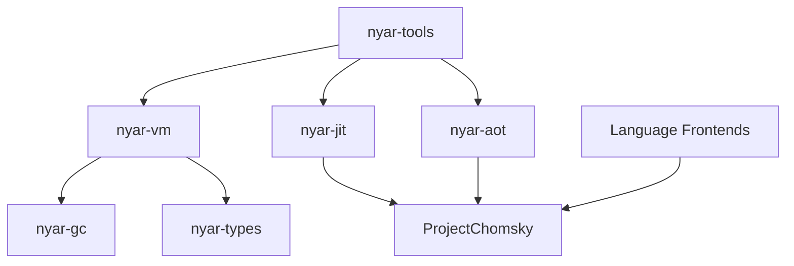

# 核心项目维护指南

Nyar VM 采用了高度模块化的架构设计，旨在构建一个跨语言、跨平台的通用运行时环境。其核心理念是通过 `ProjectChomsky` 的 `UIR`（Universal IR）作为中转站，实现“一次编写，多处编译/执行”。

## 架构总览

Nyar VM 的生态系统主要分为三层：

1.  **前端层 (Frontends)**: 各类编程语言前端（如 Mini-C, Mini-Java 等），负责将源码解析为 `IKun` 意图流。
2.  **中间层 (Infrastructure)**:
    -   **nyar-types**: 基础错误定义与公共数据结构。
    -   **nyar-gc**: 托管堆内存管理。
    -   **ProjectChomsky**: 核心优化引擎（E-Graph 饱和优化）。
3.  **执行层 (Execution)**:
    -   **nyar-vm**: 字节码解释执行与异步运行时。
    -   **nyar-jit**: 基于热点分析的即时编译。
    -   **nyar-aot**: 静态编译到目标构件（Native/WASM/JVM）。
    -   **nyar-tools**: 开发者工具链。

## 项目调用关系

## 项目目录

- [nyar-vm](nyar-vm.md): 核心运行时、字节码定义与解释器。
- [nyar-types](nyar-types.md): 通用基础类型与错误处理。
- [nyar-gc](nyar-gc.md): 垃圾回收器实现。
- [nyar-jit](nyar-jit.md): 即时编译器驱动。
- [nyar-aot](nyar-aot.md): 静态编译器驱动。
- [nyar-tools](nyar-tools.md): 命令行工具链。
