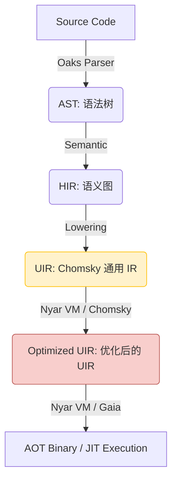

# Valkyrie 项目架构与维护指南

**文档版本**: 1.0
**目标读者**: Valkyrie 项目的核心开发者与维护者

## 1. 顶层设计原则

Valkyrie 的架构遵循现代编译器设计的最佳实践，旨在平衡高性能、可扩展性与开发效率。

### 1.1 现代编译流水线 (Modern Compilation Pipeline)

Valkyrie 的架构已演进为以 **Nyar VM** 和 **Chomsky** 为核心的现代化流水线，将传统的降级过程与先进的 E-Graph 优化结合。

- **AST -> HIR**: 引入作用域、名称解析和类型信息。
- **HIR -> UIR**: 将语言特定的语义原语转换为 Chomsky 的通用意图 (Intents)。
- **UIR Optimization**: 利用 Chomsky 的等价饱和引擎在 Nyar VM 中进行全局优化。
- **Backend Emission**: 通过 Gaia 驱动的代码发射器生成机器码或二进制制品。

### 1.2 开发者体验 (DX) 至上

- **诊断信息**: 使用 `miette` 提供高质量的错误报告。
- **即时反馈**: 通过高效的增量编译（规划中）实现快速迭代。

## 2. 项目组织 (Crate Structure)

Valkyrie 采用 Rust Monorepo 结构，所有核心组件位于 `projects/` 目录下。

- **`valkyrie-compiler`**: **核心编译器前端与降级层**。基于 Oaks 构建，负责将源代码降级为 Chomsky UIR。
- **`valkyrie-types`**: 编译器使用的核心类型定义。
- **`nyar-vm`**: **核心运行时与优化驱动**。集成 Chomsky 优化引擎，提供 AOT 和 JIT 执行能力。
- **`valkyrie-error`**: 统一的错误定义与诊断渲染。
- **`valkyrie-lsp`**: 语言服务器支持。
- **`valkyrie-cli`**: 命令行工具。
- **`oak-valkyrie`**: 基于 Oak 的新版前端实现（Lexer, Parser, AST）。

## 3. 维护流程

### 3.1 添加新的优化 Pass
1. 在 `valkyrie-vm` 中实现对应的 Trait（如 `CfgFunctionPass` 或 `SsaFunctionPass`）。
2. 在 `valkyrie-vm/src/passes/` 目录下添加对应的优化逻辑。
3. 编写单元测试和快照测试验证输出。

### 3.2 错误处理规范
- 所有编译器错误应定义在 `valkyrie-error` 中。
- 使用 `miette` 提供的宏来丰富错误上下文。
