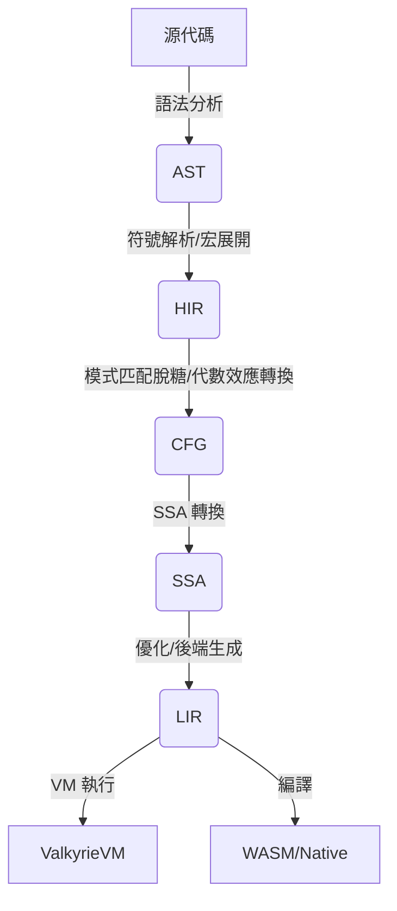

# Valkyrie 編譯器優化策略：從抽象語法到機器碼的極致之旅

## 前言

本文檔全面闡述了 Valkyrie 編譯器採用的多層中間表示（IR）架構，並深入剖析了在每一層 IR 上實施的核心優化策略。Valkyrie 的設計哲學根植於：**分層抽象（Layered Abstraction）**與**漸進式脫糖（Progressive Desugaring）**。

## 第一章：架構哲學與優化全景圖

### 1.1 核心設計哲學

1.  **分層抽象 (Layered Abstraction)**
    Valkyrie 將編譯過程分解為 5 個專門的 IR 層：
    *   **AST (抽象語法樹):** 直接反映源代碼結構。
    *   **HIR (高層 IR):** 攜帶完整語義，進行模式匹配脫糖和符號解析。
    *   **CFG (控制流圖):** 消除高層控制流結構（如循環、分支），轉為基本塊。
    *   **SSA (靜態單賦值):** 實施經典數據流優化（如常量傳播、死代碼消除）。
    *   **LIR (低層 IR):** 接近目標硬件（如 WASM 或 VM 字節碼）。

### 1.2 多層 IR 架構概覽

*   **AST:** 語法規範化。
*   **HIR:** 語義分析核心。
*   **CFG:** 控制流分析基礎。
*   **SSA:** 核心優化引擎。
*   **LIR:** 目標生成。

## 第二章：各階段優化詳述

### 2.1 AST 階段
*   **宏展開:** 在語法層面處理代碼生成。
*   **常量折疊:** 基礎的算術預計算。

### 2.2 HIR 階段
*   **符號解析:** 確定變數和函數的定義域。
*   **模式匹配脫糖:** 將複雜的 `match` 轉換為決策樹。
*   **代數效應轉換:** 將 `try/handle` 邏輯轉化為棧操作。

### 2.3 CFG 階段
*   **不可達代碼消除:** 移除無法執行的基本塊。
*   **塊合併:** 合併單一出口/入口的基本塊以減少跳轉。

### 2.4 SSA 階段
*   **稀疏有條件常量傳播 (SCCP):** 結合控制流的常量傳播。
*   **公共子表達式消除 (CSE):** 移除重複計算。
*   **死代碼消除 (DCE):** 移除無副作用且未被使用的賦值。

### 2.5 LIR 階段
*   **寄存器分配/棧槽分配:** 針對目標機器的內存布局優化。
*   **窺孔優化:** 局部指令替換。

---
*注：Valkyrie 致力於在保證類型安全的前提下，通過深度的 SSA 優化榨取每一分性能。*
