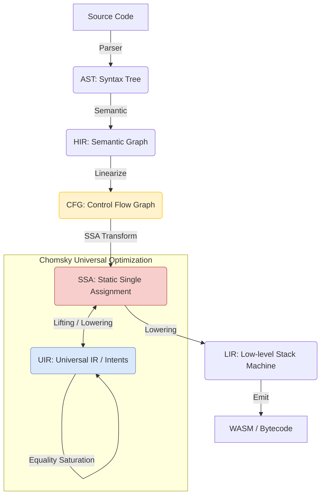

# Nyar VM 項目架構與維護指南

**文檔版本**: 1.0
**目標讀者**: Nyar 項目的核心開發者與維護者

## 1. 頂層設計原則

Nyar 的架構遵循現代編譯器設計的最佳實踐，旨在平衡高性能、可擴展性和開發效率。

### 1.1 漸進式下放 (Progressive Lowering)

Nyar 將複雜的編譯過程分解為 5 個主要的中間表示 (IR) 階段。每個階段職責單一，並通過一系列遍 (Pass) 進行變換。

- **AST -> HIR**: 引入作用域、名稱解析和類型信息。
- **HIR -> CFG**: 將結構化代碼（如 `if`, `while`）轉換為基本塊和顯式跳轉。
- **CFG -> SSA**: 變量版本化、插入 Phi 節點，便於數據流分析。
- **Chomsky 普遍優化**: 
    - **語義提升 (Lifting)**: 將 SSA 或更高層的 IR 提升為 **UIR (Universal IR)**。
    - **等價飽和 (Equality Saturation)**: 利用 E-Graph 引擎在等價空間中搜索最優路徑。
    - **成本模型提取**: 根據目標後端（如 `nyar-vm`）的成本模型提取最優實現。
- **SSA -> LIR**: SSA 銷毀、Phi 消除，以及向下放到棧式指令。
- **LIR -> Emit**: 最終生成可執行的字節碼。

### 1.2 開發者體驗 (DX) 優先

- **診斷信息**: 提供高質量的錯誤報告。
- **即時反饋**: 通過高效的增量編譯實現快速迭代。

## 2. 項目組織 (Crate 結構)

Nyar 採用 Rust Monorepo 結構，所有核心組件位於 `projects/` 目錄下。

- **`nyar-types`**: **核心 IR 定義庫**。包含 HIR, CFG, SSA 和 LIR 的數據結構。
- **`nyar-vm`**: **解釋器與運行時**。實現棧式字節碼解釋器。
- **`nyar-aot`**: **編譯器與優化器**。負責各階段間的變換、使用 Chomsky 進行優化，以及最終字節碼生成。
- **`nyar-tools`**: 命令行工具。

## 3. 維護流程

### 3.1 添加新的優化遍 (Optimization Pass)
1. 在 `nyar-aot` 目錄中實現相應的優化邏輯，通常利用 Chomsky 框架。
2. 編寫單元測試和快照測試以驗證輸出。
