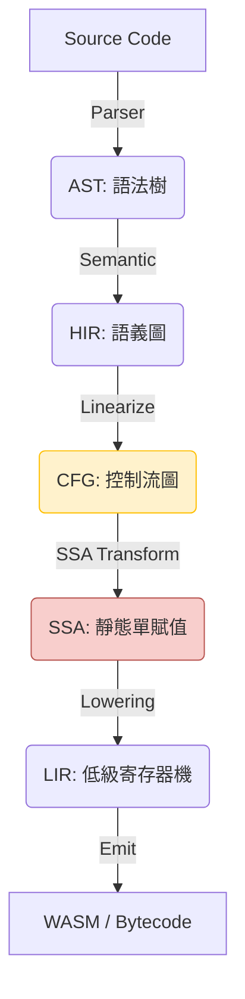

# Valkyrie 項目架構與維護指南

**文檔版本**: 1.0
**目標讀者**: Valkyrie 項目的核心開發者與維護者

## 1. 頂層設計原則

Valkyrie 的架構遵循現代編譯器設計的最佳實踐，旨在平衡高性能、可擴展性與開發效率。

### 1.1 漸進式降級 (Progressive Lowering)

Valkyrie 將複雜的編譯過程分解為 5 個主要的中間表示 (IR) 階段。每個階段職責單一，通過一系列 Pass 進行轉換。

- **AST -> HIR**: 引入作用域、名稱解析和類型信息。
- **HIR -> CFG**: 將結構化代碼（如 `if`, `while`）轉換為基本塊和顯式跳轉。
- **CFG -> SSA**: 變數版本化，插入 Phi 節點，便於數據流分析。
- **SSA -> LIR**: SSA 銷毀，寄存器分配，面向物理/虛擬機器指令。

### 1.2 開發者體驗 (DX) 至上

- **診斷信息**: 使用 `miette` 提供高質量的錯誤報告。
- **即時反饋**: 通過高效的增量編譯（規劃中）實現快速迭代。

## 2. 項目組織 (Crate Structure)

Valkyrie 採用 Rust Monorepo 結構，所有核心組件位於 `projects/` 目錄下。

- **`valkyrie-types`**: **核心 IR 定義庫**。包含 HIR, CFG, SSA, LIR 的數據結構。
- **`valkyrie-vm`**: **核心邏輯與 Pass 實現**。負責各階段轉換、優化及最終執行。
- **`valkyrie-error`**: 統一的錯誤定義與診斷渲染。
- **`valkyrie-lsp`**: 語言伺服器支持。
- **`valkyrie-cli`**: 命令行工具。
- **`oak-valkyrie`**: 基於 Oak 的新版前端實現（Lexer, Parser, AST）。

## 3. 維護流程

### 3.1 添加新的優化 Pass
1. 在 `valkyrie-vm` 中實現對應的 Trait（如 `CfgFunctionPass` 或 `SsaFunctionPass`）。
2. 在 `valkyrie-vm/src/passes/` 目錄下添加對應的優化邏輯。
3. 編寫單元測試和快照測試驗證輸出。

### 3.2 錯誤處理規範
- 所有編譯器錯誤應定義在 `valkyrie-error` 中。
- 使用 `miette` 提供的宏來豐富錯誤上下文。
