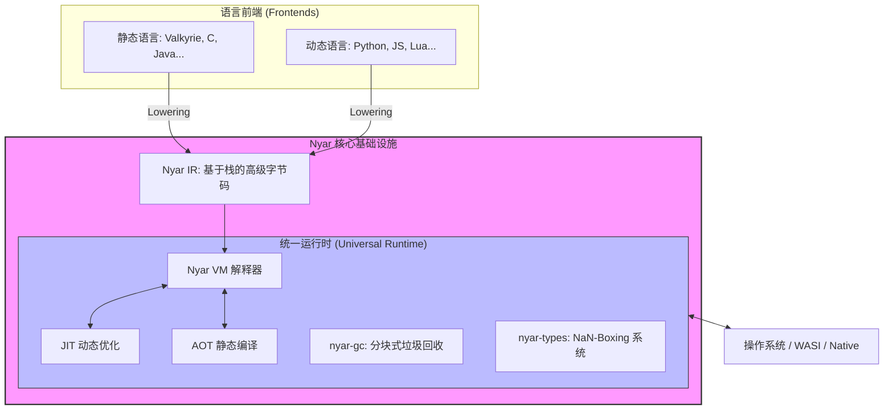
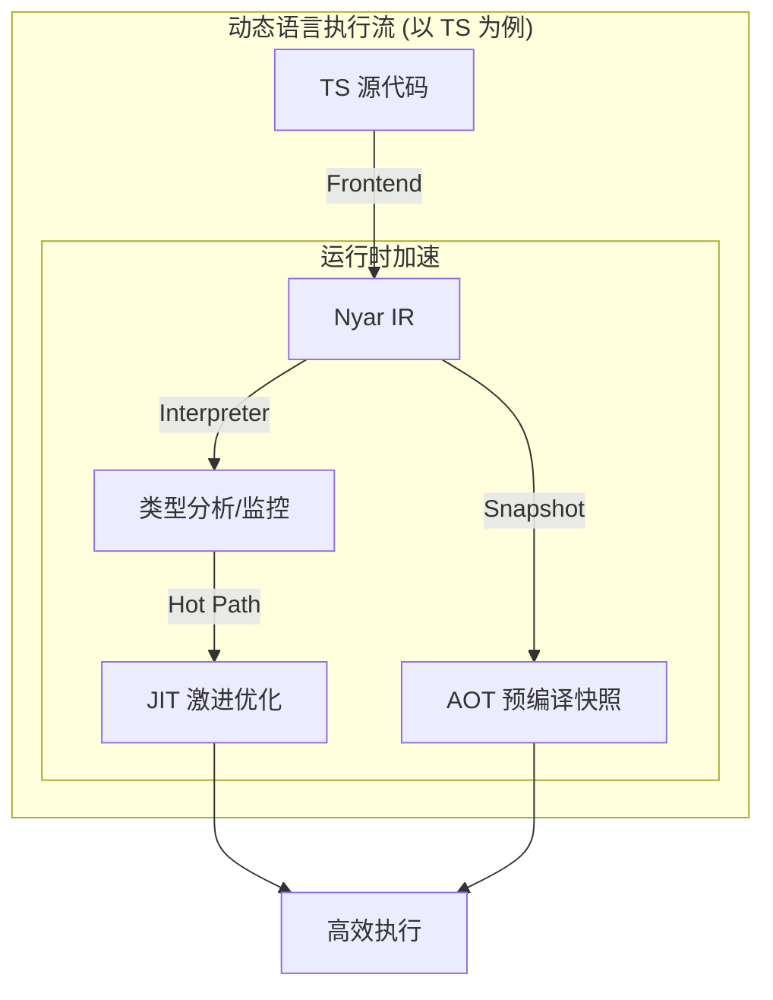
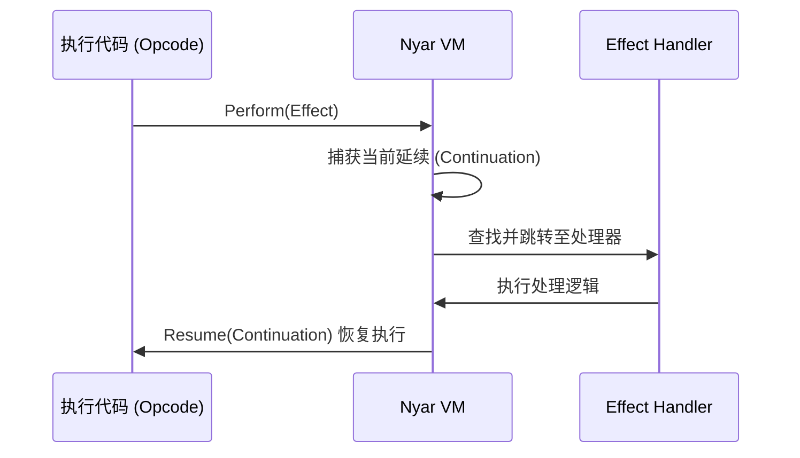
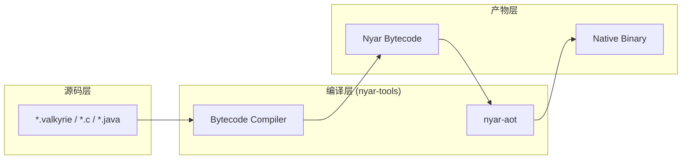

# Nyar Runtime (NyarVM)

[](https://www.rust-lang.org/)
[](#)

**NyarVM** 是一款专为现代编程语言设计的高性能、跨平台虚拟机关编译器基础设施。作为 **Valkyrie** 编程语言的核心执行引擎，它提供了一套统一的运行时环境，旨在打破语言壁垒，实现异构语言在同一高性能底座上的无缝协作。

## 🚀 核心架构：三位一体的执行语言



NyarVM 的设计核心在于其对三种不同形态语言的深度整合与统一执行，这使得它能够同时满足极致性能与高度灵活性的双重需求。

### 1. 静态语言 (Static Languages)
针对预编译和高性能场景，NyarVM 提供了一套严谨的类型系统和 AOT（预编译）基础设施。
- **强类型安全**：支持复杂的泛型、高阶类型（HKT）及特征系统（Trait System）。
- **零成本抽象**：通过静态分发和单态化优化，确保抽象层不引入额外开销。

```mermaid
graph LR
    subgraph Static_Flow ["静态语言执行流 (以 C 为例)"]
        C_Src[C 源代码] -->|Clang/Frontend| Nyar_IR[Nyar IR]
        
        subgraph Execution ["混合执行策略"]
            Nyar_IR -->|nyar-aot| Native[原生二进制 (AOT)]
            Nyar_IR -->|nyar-jit| Optimized[机器码 (JIT)]
            Nyar_IR -->|nyar-vm| Interp[解释执行]
        end
    end
    
    Native --> Output[运行产物]
    Optimized --> Output
    Interp --> Output
```

### 2. 动态语言 (Dynamic Languages)
为了支持脚本化和快速开发，NyarVM 内置了强大的动态特性。
- **对象级动态性**：支持动态对象模型（Dynamic Objects）、鸭子类型（Duck Typing）以及运行时的代码求值（Eval）。
- **NaN-Boxing 编码**：采用高效的 NaN-Boxing 技术，将所有运行时类型（包括 47 位整数、布尔、GC 指针等）压缩在 64 位字宽内，极大地提升了动态类型的处理速度。




- **即时优化**：JIT 编译器能根据运行时收集的类型信息，动态生成特化的优化代码。

### 3. Nyar IR (中间表示)
Nyar IR 是整个系统的基石，是一种基于栈（Stack-based）的高级字节码。
- **统一底座**：无论是静态语言还是动态语言，最终都会降解（Lowering）为 Nyar IR 执行。
- **代数效应 (Algebraic Effects)**：IR 层级原生支持代数效应，为错误处理、协程、生成器等高阶控制流提供了一流的性能表现。



- **扩展指令集**：针对数值计算（I32/I64/F64/BigInt）和字符串处理提供专门的扩展指令，平衡了通用性与专业性能。

## 🏗️ 项目结构



本工作空间由多个核心子项目及语言前端示例组成：

### 核心项目 (`/projects`)

- **[nyar-vm](./projects/nyar-vm)**: 虚拟机核心，包含字节码解释器、驱动程序及异步运行时。
- **[nyar-types](./projects/nyar-types)**: 贯穿整个生态系统的基础类型系统定义，实现 NaN-Boxing。
- **[nyar-gc](./projects/nyar-gc)**: 针对 Nyar 执行模型优化的垃圾回收器，支持 TLAB 与分块管理。
- **[nyar-jit](./projects/nyar-jit)**: 基于运行时信息进行动态性能优化的即时编译基础设施。
- **[nyar-aot](./projects/nyar-aot)**: 用于生成原生二进制的预编译工具链。

### 语言前端示例 (`/examples`)

NyarVM 验证了其作为通用运行时的能力，提供了多种语言的实验性前端：
- **Rusty-C / Rusty-Java / Rusty-Go / Rusty-CSharp** 等。

## 🛠️ 快速开始

### 环境准备
- [Rust](https://www.rust-lang.org/tools/install) (Stable 或 Nightly)

### 构建与运行
```powershell
# 构建项目
cargo build --release

# 运行测试
cargo test

# 运行程序
cargo run -p nyar-vm -- <input_file>
```

## 📖 文档中心

关于 Nyar 架构的详细技术说明请参阅 `documentation/` 目录：
- **[Nyar IR 指令集详情](./documentation/zh-hans/maintenance/nyar-ir.md)**
- **[对象级动态技术](./documentation/zh-hans/guide/dynamic.md)**
- **[NaN-Boxing 类型系统](./documentation/zh-hans/maintenance/nyar-types.md)**
- **[Valkyrie 语言特性指南](./documentation/zh-hans/guide/features.md)**
