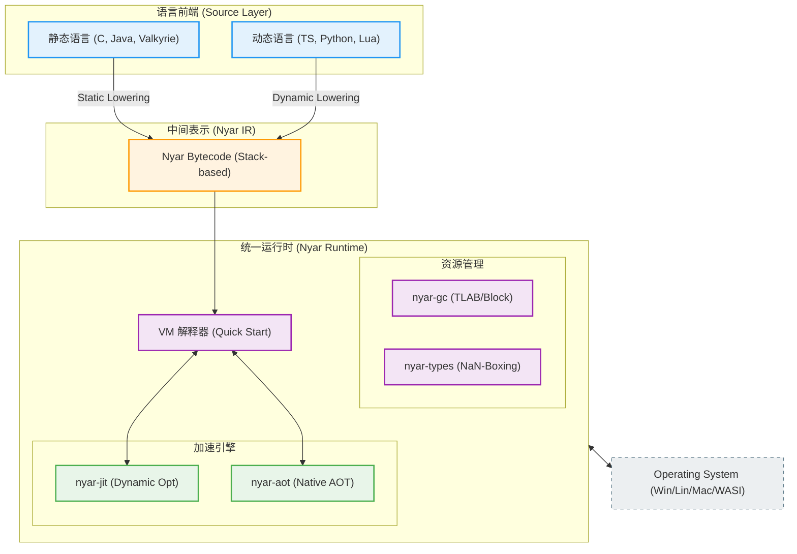
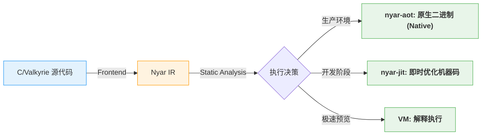
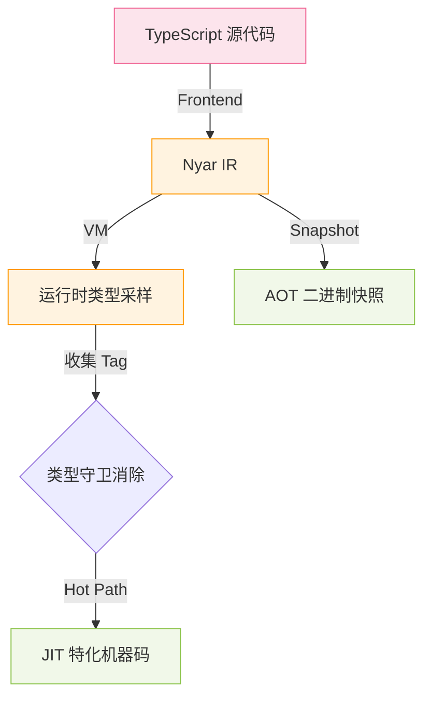
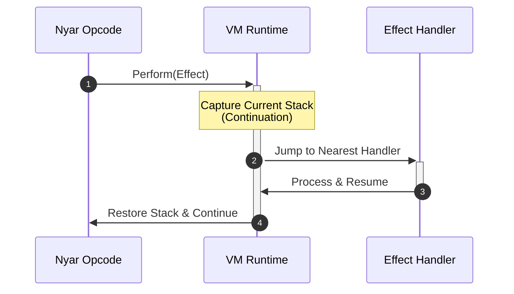
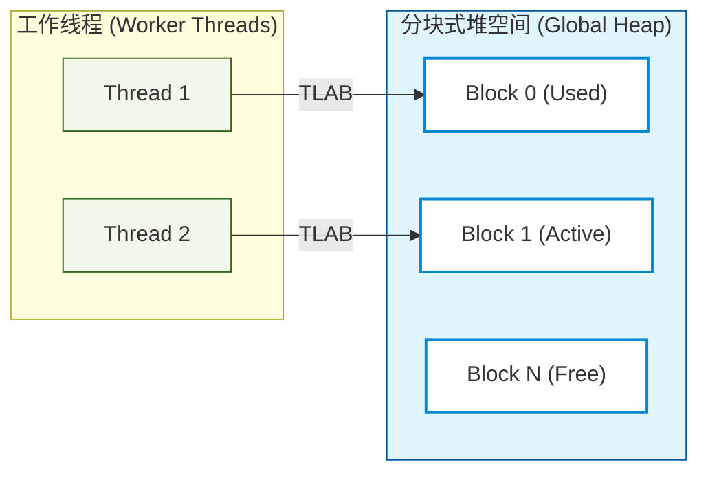

# Nyar Universal Runtime (NyarVM)

[](https://www.rust-lang.org/)
[](#)

**NyarVM** 是一款专为现代编程语言设计的高性能、跨平台虚拟机关编译器基础设施。它通过统一的 **Nyar IR** 层，实现了静态语言与动态语言在同一运行时底座上的无缝协作。

---

## 🏗️ 核心架构：三位一体的执行语言

NyarVM 的设计核心在于将异构语言前端降解为统一的字节码表示，并根据运行环境灵活选择执行策略。



---

## 🏎️ 混合执行策略

### 1. 静态语言流 (Static Languages)
静态语言利用 NyarVM 严谨的类型系统，在编译阶段完成单态化与去抽象化。



### 2. 动态语言流 (Dynamic Languages)
动态语言通过 **NaN-Boxing** 技术实现高效的运行时类型分发。



#### NaN-Boxing 64-bit 内存布局
所有动态类型（指针、整数、布尔）均压缩在 8 字节字宽内，零开销识别。


---

## 🧩 核心基础设施

### 1. 代数效应 (Algebraic Effects)
Nyar IR 原生支持高阶控制流，通过捕获 **Continuation** 实现极致性能的异步与协程。



### 2. 内存管理 (nyar-gc)
专为 Nyar 执行模型设计的垃圾回收器，支持线程本地分配缓存 (TLAB)。



---

## 🏗️ 项目模块导航

| 模块 | 路径 | 功能描述 |
| :--- | :--- | :--- |
| **虚拟机核心** | [`nyar-vm`](./projects/nyar-vm) | 字节码解释器、异步运行时及驱动 |
| **类型系统** | [`nyar-types`](./projects/nyar-types) | NaN-Boxing 实现与核心类型定义 |
| **垃圾回收** | [`nyar-gc`](./projects/nyar-gc) | 高性能分块式垃圾回收器 |
| **加速引擎** | [`nyar-jit`](./projects/nyar-jit) / [`nyar-aot`](./projects/nyar-aot) | 动态与静态编译优化工具链 |
| **示例前端** | [`examples/`](./examples) | C, Java, Go, TS 等多种语言的 Nyar 实现 |

---

## 🛠️ 快速开始

```powershell
# 构建全量发布版本
cargo build --release

# 运行基准测试
cargo bench -p nyar-vm

# 执行 Nyar 字节码程序
cargo run -p nyar-vm -- <input_file>
```

## 📖 深入探索
- [Nyar IR 指令集详情](./documentation/zh-hans/maintenance/nyar-ir.md)
- [对象级动态技术](./documentation/zh-hans/guide/dynamic.md)
- [NaN-Boxing 系统深度解析](./documentation/zh-hans/maintenance/nyar-types.md)
